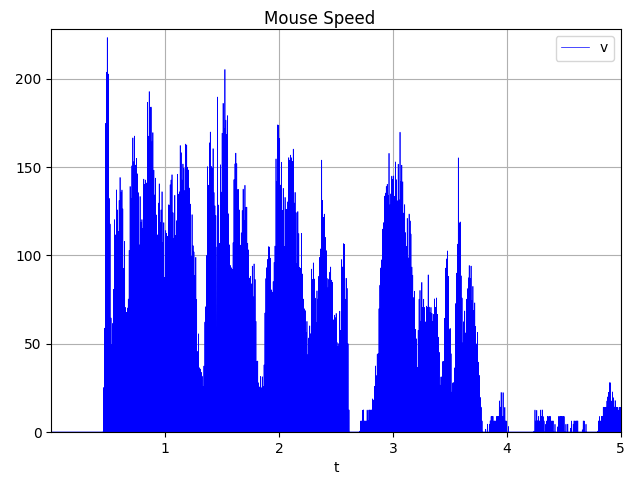
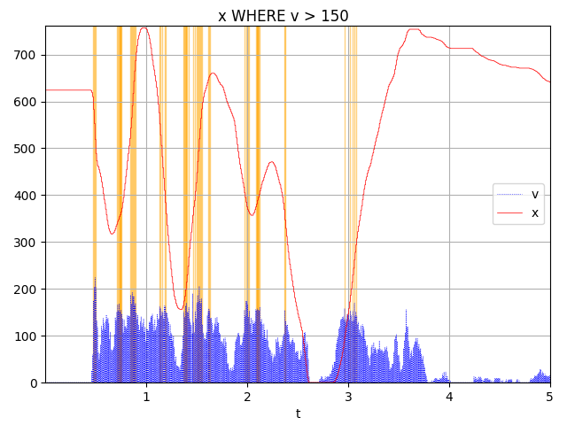
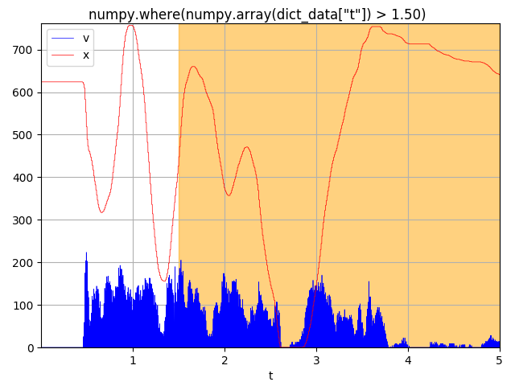
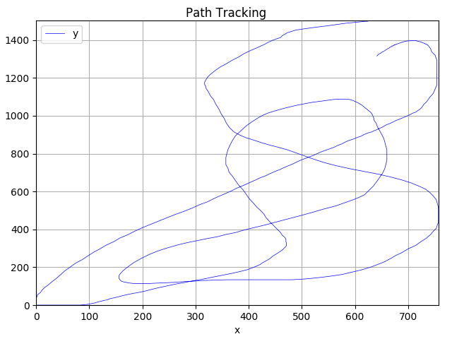

## CSV Analyzer
Very fast and scriptable CSV plotting and analysis tool in Python

	usage: csv_analyzer.py [-h] [-f FILE] [-x X_COL_NAME] [-r STARTROW]
	                       [-e ENDROW] [-t expression] [-i TITLE] [-s] [-c] [-m]
	                       [--scatter] [--colorbyplot]
	                       COL_NAME [COL_NAME ...]
	
	Plot collection of variables for a csv file.
	
	positional arguments:
	  COL_NAME              column name(s) of the plot items
	
	optional arguments:
	  -h, --help            show this help message and exit
	  -f FILE, --file FILE  CSV file to plot
	  -x X_COL_NAME, --xaxis X_COL_NAME
	                        column name of x-axis. Omission assumes first 
	                        column name is x-axis
	  -r STARTROW, --rowstart STARTROW
	                        row start number
	  -e ENDROW, --rowend ENDROW
	                        row end number (0 to end of file)
	  -t expression, --filter expression
	                        filtering expression
	  -i TITLE, --title TITLE
	                        title of plot
	  -s, --sessionstart    starts a new session so we only load data & assign
	                        colors once
	  -c, --sessioncontinue
	                        Continues an existing session so we only load data &
	                        assign colors once
	  -m, --terminate       Closes immediately after data load and session save, no visual plotting
	  --scatter             Create scatter plots from pairs of header names
	  --colorbyplot         Keep plot color scheme consistent by plot order

###Examples
Given a CSV file named "path.csv" with colums t, x, y, v

Timeseries Plot of v vs t:

	./csv_analyzer.py t v -f path.csv --title "Mouse Speed"
	
 

	
Highlight values where v > 150 (psuedo-SQL):

	./csv_analyzer.py t x v -f path.csv --filter "SELECT x WHERE v > 150" --title "x WHERE v > 150"
	
 
	
Highlight values where t > 1.5 (numpy where):

	./csv_analyzer.py t x v -f path.csv --filter "numpy.where(numpy.array(dict_data[\"t\"]) > 1.50)" --title "numpy.where(numpy.array(dict_data[\"t\"]) > 1.50""
	
 
	
Show a scatter plot of x vs y (path plot):

	./csv_analyzer.py x y -f path.csv --scatter
	
 
	
You can generate multiple plots from the same data and load the CSV file only a single time by using --sessionstart and --sessioncontinue. See the example in the "update_plots.sh" script within the test directory for an example. Intermediate calls to the script will load a temporary pickle file to save processing time.