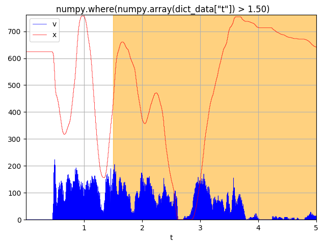

## CSV Analyzer Overview

CSV Analyzer is a simple scriptable python tool for plotting comma separated value data (CSV). It is primarily aimed at timeseries and scatter plots. You can create multiple plots from a single reading of a CSV file. This greatly speeds up the process for many use cases when dealing with very large data sets. In addition, plots can be highlighted based on selection criteria, defined either by "pseudo-SQL" selection or numpy conditions.

### How It Works
CSV data is parsed into a dictionary of arrays.  Each array is generated from a column of CSV data indexed by its header label. Generally, the Python "csv" module is used, but in the rare edge case where it may fail on extremely large files, a raw file parsing I/O is available. In the newer releases of Python, large file parsing seems to be less of an issue than it used to be when dealing with csv files on the order of magnitude of 100MB of text or more.

When a csv file is designated for loading by calling the script with the "--sessionstart" switch, a pickle file of the data dictionary is cached for subsequent loading and use, facilitating extremely fast reloading on the next call. Subsequent script calls can then use the switch "--sessioncontinue" to load from that pickle file.

### Highlighting and Selection
Critical events can be highlighted in a plot via the "filter" switch. This allows one to write psuedo-SQL style selections based on the CSV header labels. For instance, given the CSV headers of: t,x,y,velocity, if t is time, and defined as the x-axis for a timeseries, all the time-points where the velocity exceeded a particular value on a timeseries plot of "x vs t" may be highlighted with the pseudo-SQL "filter":

	"SELECT x WHERE v > 150"

"SELECT" items will be drawn in solid lines, other items will turn dotted. Alternatively, the precise numpy filter code for highlighted timestamp regions can be passed since it is simply a wrapper around calling "exec" on numpy arrays:
	
	"numpy.where(numpy.array(dict_data[\"v\"]) > 150)"

The pseudo-SQL is simply translated to the appropriate numpy syntax and the final filtering code is wrapped into the run-time execution call of:
	
	"res  = " + filterstring

The timeseries indexes of the returned data are marked for highlighting in the output plot. Matplotlib is used for generating all plots.

### Useage
usage: csv_analyzer.py [-h] [-f FILE] [-x X_COL_NAME] [-r STARTROW]
	                       [-e ENDROW] [-t expression] [-i TITLE] [-s] [-c] [-m]
	                       [--scatter] [--colorbyplot]
	                       COL_NAME [COL_NAME ...]
	
	Plot collection of variables for a csv file.
	
	positional arguments:
	  COL_NAME              column name(s) of the plot items
	
	optional arguments:
	  -h, --help            show this help message and exit
	  -f FILE, --file FILE  CSV file to plot
	  -x X_COL_NAME, --xaxis X_COL_NAME
	                        column name of x-axis. Omission assumes first 
	                        column name is x-axis
	  -r STARTROW, --rowstart STARTROW
	                        row start number
	  -e ENDROW, --rowend ENDROW
	                        row end number (0 to end of file)
	  -t expression, --filter expression
	                        filtering expression
	  -i TITLE, --title TITLE
	                        title of plot
	  -s, --sessionstart    starts a new session so we only load data & assign
	                        colors once
	  -c, --sessioncontinue
	                        Continues an existing session so we only load data &
	                        assign colors once
	  -m, --terminate       Closes immediately after data load and session save, no visual plotting
	  --scatter             Create scatter plots from pairs of header names
	  --colorbyplot         Keep plot color scheme consistent by plot order

### Real Examples

Given a CSV file named "path.csv" with columns t, x, y, v, offx, offy

Timeseries Plot of v vs t. Note that the x-axis "t" is the first header passed:

	./csv_analyzer.py t v -f path.csv --title "Mouse Speed"
	
 
	
Highlight x-axis timestamps where v > 150 and draw x as solid, other lines dotted (pseudo-SQL):

	./csv_analyzer.py t x v -f path.csv --filter "SELECT x WHERE v > 150"  --title "x WHERE v > 150"
	
 
	
Highlight x-axis timestamps where t > 1.5 (numpy where):

	./csv_analyzer.py t x v -f path.csv --filter "numpy.where(numpy.array(dict_data[\"t\"]) > 1.50)" --title "numpy.where(numpy.array(dict_data[\"t\"]) > 1.50"
	
 
	
Show a scatter plot of x vs y (path plot):

	./csv_analyzer.py x y -f path.csv --scatter --title "Path Tracking"
	
 
	
Compare 2 scatter plots:

	./csv_analyzer.py x y offx offy -f path.csv --scatter --title "Path Tracking Compare"
	
 
	
You can generate multiple plots from the same data and load the CSV file only a single time by using the switches "--sessionstart" and "--sessioncontinue" at the first call and subsequent calls, respectively. See the example in the "update_plots.sh" script within the test directory for an example. Intermediate calls to the script will load a temporary pickle file to save processing time.

### Give it a Try

A script to generate path and speed tracking data from your mouse movements exists in the "test" directory: "generate_path_data.py". Use the "duration" switch to vary the duration in seconds to collect CSV data. The default output file name is "path.csv", as used in the above examples. In my testing, 1 minute of data collection will generate around 30-40MB of CSV text data.

A good example of making multiple calls to the csv_analyzer while only loading the raw CSV data a single time appears in the test directory as well, see the bash script: "update_plots.sh". Note the little bash trick to capture Ctrl-C keyboard events that will automatically close all the open matplotlib windows when triggered through the SIGINT trap.
